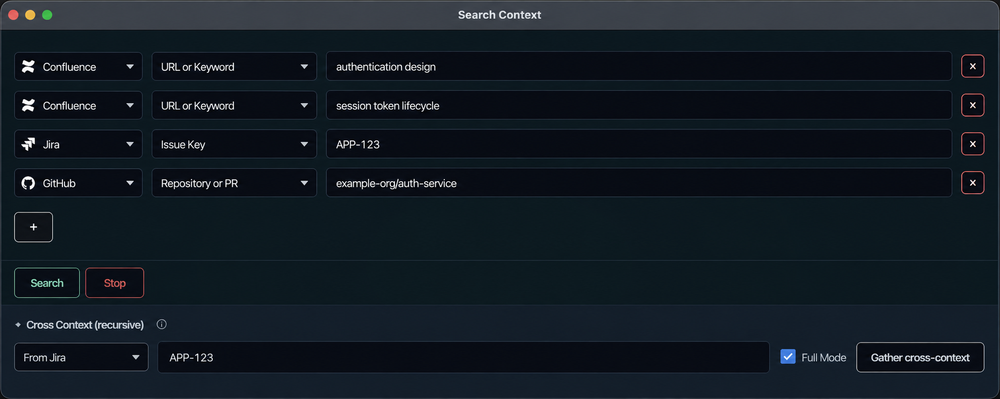
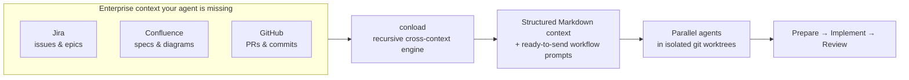
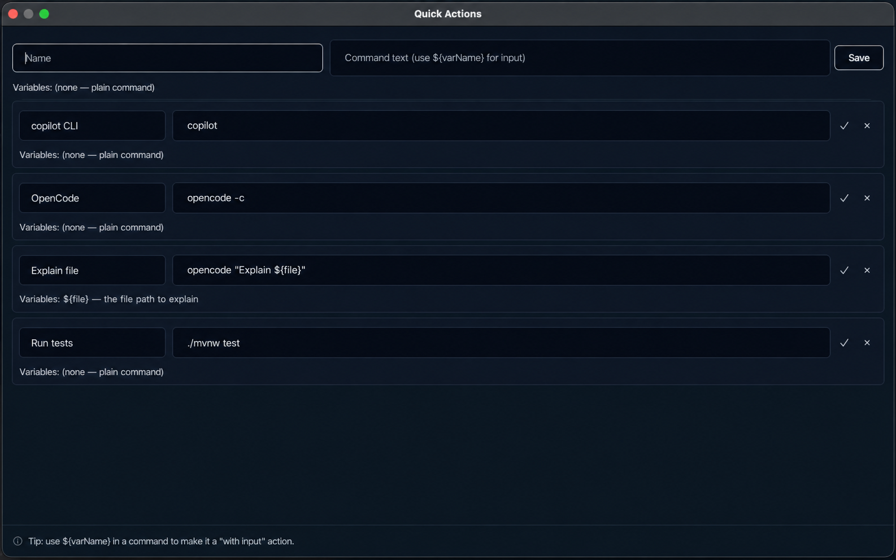
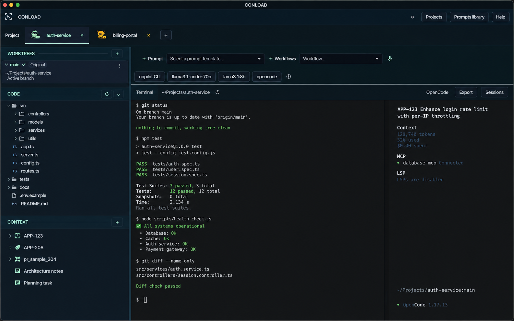

# conload

[](LICENSE)
[](https://github.com/soft-am/conload/releases/latest)
[](https://github.com/soft-am/homebrew-tap)
[](https://github.com/soft-am/conload)

**The Agentic Development Environment for CLI coding agents.**

Run any CLI agent — with the engineering context, workflows, and prompts that make it productive. Prepare, implement, and review code grounded in Jira, Confluence, and GitHub — not just the repo.

> Context your team already has → structured Markdown your agent reads → parallel agents in isolated worktrees → ship.

---

## Why conload

Coding agents are great at understanding your **codebase**. But the reason the code exists lives elsewhere:

- Requirements in **Jira**
- Architecture decisions in **Confluence**
- Implementation history in **commits**
- Discussion and decisions in **pull requests**

Without that context, an agent understands *what* the code does while missing *why* it does it.

`conload` is **not another coding agent**. It's the development environment that bridges the gap — giving the agents you already use the engineering context they need to be productive. And it's the only one that recursively pulls context from Jira, Confluence, and GitHub into agent-ready Markdown, then wires it into parameterized workflows.

---

## Install

### macOS & Linux (Homebrew)

```bash
brew install soft-am/tap/conload
conload
```

Pulls in `openjdk@21` automatically. Upgrade with `brew upgrade soft-am/tap/conload`.

### Windows

Download [`conload-windows.jar`](https://github.com/soft-am/conload/releases/latest/download/conload-windows.jar) and run:

```bash
java -jar conload-windows.jar
```

<sup>Requires JDK 21. Building from source, IntelliJ setup, per-OS JARs, and native installers &rarr;
[docs/DEVELOPMENT.md#build-from-source](docs/DEVELOPMENT.md#build-from-source)</sup>

---

<p align="center">
  
</p>

---

## How it works



Give `conload` one starting point — a Jira key, a Confluence URL, or a GitHub PR. It recursively follows links *between* sources (Jira &harr; Confluence &harr; commits), deduplicates everything globally, and writes a structured local context folder with a human-readable `cross_context_hierarchy.md` map your agent reads first.

---

## Features

### Context your agent can actually read

Your agent finally sees the spec behind the code. Download Confluence page trees, Jira issues, and GitHub commits/PRs into structured local folders the agent reads directly — without a browser, without copy-paste.

- **Confluence** &rarr; XHTML to Markdown with diagram extraction (Mermaid, PlantUML, draw.io, Gliffy, BPMN) and attachment deduplication.
- **Jira** &rarr; Atlassian Document Format to Markdown with metadata tables, comments, linked issues, and attachments.
- **GitHub** &rarr; commit search by keyword, PR fetch with diffs exported as JSON. Works with github.com and GitHub Enterprise.

<p align="center">
  
</p>

### Workflows for the full dev lifecycle

From Jira key to refinement doc in one click. Built-in workflows gather context and produce a ready-to-send prompt — fill the input, click **Gather Context**, review the generated prompt, click **Send**. Re-run from the file tree with no API calls.

| Workflow | Input | What it gathers |
|---|---|---|
| **Prepare to Refinement** | Jira key(s) / URLs / keywords | Seed issue + related issues (recursive) + linked Confluence trees + GitHub commits + parent epic + top-word discovery |
| **Code Review** | GitHub PR URL(s) | PR metadata + diff + commits; Jira keys and Confluence URLs discovered from PR and commit messages |
| **Confluence Reverse-Engineering** | Confluence URL or keyword | Page tree download; Jira keys discovered from page content; recursive engine takes over |

> Full vs. Fast mode, output-section templates, and extensibility &rarr;
> [docs/DEVELOPMENT.md#workflow-system-internals](docs/DEVELOPMENT.md#workflow-system-internals)

### Parallel agents in isolated worktrees

Run three features in three agents at once — without `git stash` chaos. Create and switch linked worktrees directly from the sidebar. Each worktree gets its own working directory, terminal, agent session, and branch context.

<p align="center">
  
</p>

### Real terminals for any CLI agent

The VS Code terminal engine, per project. Real embedded terminals powered by **xterm.js + Pty4J** — not process pipes — so TTY-requiring agents work properly. Every project gets its own terminal with its own working directory, identity color, and agent-busy indicator. CLI definitions are user-configurable — add a new agent in seconds, no code changes needed.

### Sessions that survive restarts

Close it, reboot, come back — your session is still there. Terminal tabs are restored on restart. List, resume, and switch CLI agent sessions with one click. Export the full transcript to Markdown for documentation or handoff.

---

## Also in the box

- **[Unified multi-source search](docs/DEVELOPMENT.md#unified-multi-source-search--download)** — one parallel search across Jira, Confluence, and GitHub with per-criterion result counts; one-click download into a structured folder.
- **[Prompt templates & quick actions](docs/DEVELOPMENT.md#prompt-library)** — `${variable}` templated prompts with live placeholder fields; click the file tree to insert paths directly into variables. One-click parameterized command bar above the terminal.
- **[Project workspaces](docs/DEVELOPMENT.md#project-workspaces)** — multi-tab project ribbon with identity colors, per-project file trees, and context-folder CRUD. Like browser tabs for your agents.
- **[Focus mode](docs/DEVELOPMENT.md#terminal-tabs--session-persistence)** — full-screen native overlay with an animated agent-busy indicator (robot, alien, cat, or Yoda) so you can let the agent work undisturbed.
- **[Offline speech-to-text](docs/DEVELOPMENT.md#offline-speech-to-text-vosk)** — bundled Vosk model (~40 MB, English + German). Dictate prompts and commands directly into the terminal. No internet needed — safe for air-gapped environments.

---

## Supported agents

Works with **any CLI agent** — if it runs in a terminal, it runs in conload.


\+ any CLI agent. CLI definitions (detection string, session-list/resume/export commands) are configurable in the **Config** tab.

---

## Privacy & offline operation

- **No external LLM API calls.** conload runs your CLI agent locally; it does not call any AI service itself.
- **No data leaves your network.** All downloads go to local folders within your corporate network.
- **Offline speech recognition.** The Vosk speech model is bundled — dictation works entirely offline.

---

## For developers

- [Cross-Context Engine internals](docs/DEVELOPMENT.md#cross-context-engine) — the six phases, global deduplication, source normalization
- [Workflow system & extensibility](docs/DEVELOPMENT.md#workflow-system-internals) — how to add a new workflow
- [Feature reference](docs/DEVELOPMENT.md#feature-reference) — detailed per-feature documentation and developer value
- [Build from source](docs/DEVELOPMENT.md#build-from-source) — requirements, IntelliJ setup, per-OS JARs, native installers
- [Project structure](docs/DEVELOPMENT.md#project-structure) — package map
- [Runtime state files](docs/DEVELOPMENT.md#runtime-state-files) — what conload writes under `~/.conload/`

---

## License

`conload` is licensed under the **Apache License 2.0** — see [LICENSE](LICENSE). Attribution and third-party
notices are in [NOTICE](NOTICE).
